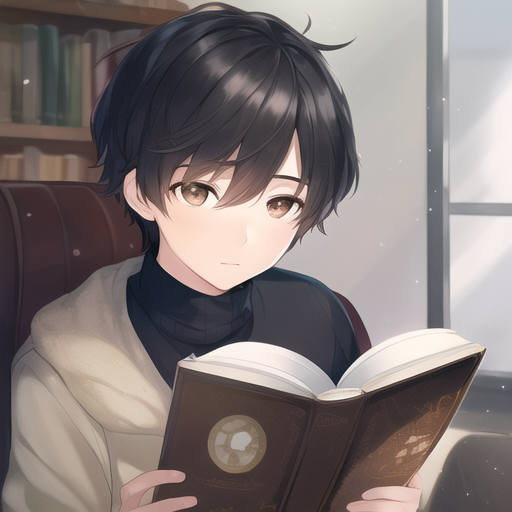
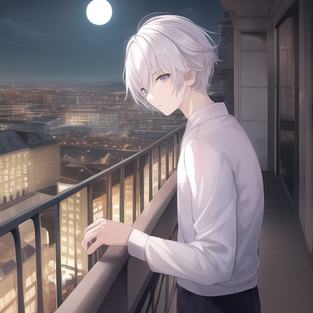
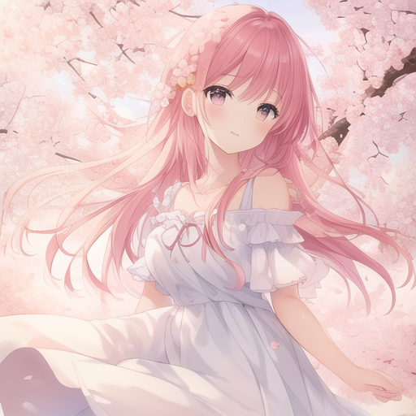

# AniMei Discord Bot

A Discord bot that generates high-quality anime-style images using the AnythingV5 Stable Diffusion model. Built with a smart queue system that handles multiple users simultaneously without blocking the bot.


Here are some images generated by the bot:

<p align="center">
  
  
  
</p>

*All images generated with the bot's AI model*

## 🎨 What It Does

- **Generates anime images** from text prompts using AnythingV5
- **Handles multiple users** with a non-blocking queue system
- **Built-in safety filters** to prevent inappropriate content
- **Discord slash commands** for easy interaction
- **Automatic image delivery** when generation completes

## 🚀 How It Works

### **Queue System & Background Workers**
The bot uses **asynchronous programming** with a smart queue system:

- **Main Event Loop (CPU)**: Handles Discord commands, queue management, and user interactions
- **Queue Worker (CPU)**: Async background process that processes requests sequentially
- **AI Model (GPU)**: Runs in separate threads on GPU for heavy neural network computations

This means your bot stays responsive to commands while images generate in the background!

### **The Process:**
1. User types `/generate` → Bot shows modal form
2. User submits prompt → Request added to queue
3. **Queue worker processes requests one by one** (prevents VRAM conflicts)
4. AI model generates image in background thread
5. Image automatically delivered to Discord when ready

## 🎮 Commands

- **`/generate`** - Opens image generation modal
- **`/queue`** - Shows current queue status and wait times

## ✍️ Writing Prompts

### **Positive Prompts (What You Want):**
- **Be specific**: `1girl, blue hair, school uniform, sitting at desk`
- **Use anime terms**: `moe, kawaii, chibi, tsundere`
- **Describe style**: `masterpiece, best quality, detailed, anime style`
- **Add details**: `long flowing hair, bright eyes, gentle smile`

### **Negative Prompts (What to Avoid):**
- **Quality issues**: `blurry, low quality, pixelated, distorted`
- **Anatomy problems**: `bad anatomy, bad hands, extra fingers`
- **Unwanted elements**: `text, watermark, signature, border`
- **Safety filters**: `nsfw, nude, inappropriate` (automatically added)

### **Prompt Examples:**
```
Positive: "1girl, long blue hair, school uniform, sitting at desk, studying, natural lighting, detailed eyes"
Negative: "blurry, low quality, bad anatomy, extra fingers, watermark, text"
```

## ⚙️ Requirements

- **Python 3.8+**
- **Discord Bot Token**
- **AnythingV5 model** (download and place in `models/Stable-diffusion/`)
- **CUDA-capable GPU** (recommended) or CPU

## 🚀 Quick Start

1. **Install dependencies:**
   ```bash
   pip install -r requirements.txt
   ```

2. **Set up configuration:**
   - Copy `env_example.txt` to `.env`
   - Add your Discord bot token to `DISCORD_BOT_TOKEN`
   - Update `MODEL_PATH` if your model is in a different location
   - `MODEL_DEVICE` will auto-detect GPU

3. **Download AnythingV5 model** and place it in the models folder

4. **Run the bot:**
   ```bash
   python main.py
   ```

## 🔧 Configuration

The bot uses sensible defaults optimized for anime generation:
- **Steps**: 25 (good balance of quality vs speed)
- **CFG Scale**: 3.5 (anime-optimized)
- **Size**: 512x512 (standard SD 1.5)
- **Queue Size**: 50 requests max
- **Safety Filters**: Built-in NSFW prevention

## 💡 Technical Details

### **Why the Queue System?**
- **Prevents VRAM conflicts** when multiple users request images
- **Keeps bot responsive** during long image generation (CPU handles coordination while GPU works)
- **Fair processing** - first come, first served
- **Background processing** - users don't wait for completion
- **Efficient resource usage** - CPU manages queue while GPU handles AI computation

### **Architecture:**
- **Main Event Loop (CPU)**: Single async thread handling Discord commands and queue management
- **Queue Worker (CPU)**: Async coroutine that processes requests one by one
- **AI Generation (GPU)**: Separate threads on GPU for neural network inference and image generation
- **Non-blocking**: Bot stays responsive during generation thanks to async programming and GPU offloading

### **CPU vs GPU Responsibilities:**
- **CPU (Main Thread)**: 
  - Discord bot coordination and user interactions
  - Queue management and request processing
  - Event loop and async task switching
  - Lightweight operations and I/O handling
  
- **GPU (AI Model Threads)**:
  - Neural network inference and computations
  - Image generation and pixel processing
  - Tensor operations and matrix multiplications
  - Heavy mathematical operations

## 🎯 Why AnythingV5?

AnythingV5 is specifically trained for anime-style images and provides:
- **High-quality anime art** with consistent style
- **Better prompt understanding** for anime concepts
- **Optimized parameters** for anime generation
- **Faster generation** compared to general-purpose models
- **Lightweight model size** - perfect for low-cost systems
- **Efficient VRAM usage** - works well on budget GPUs

